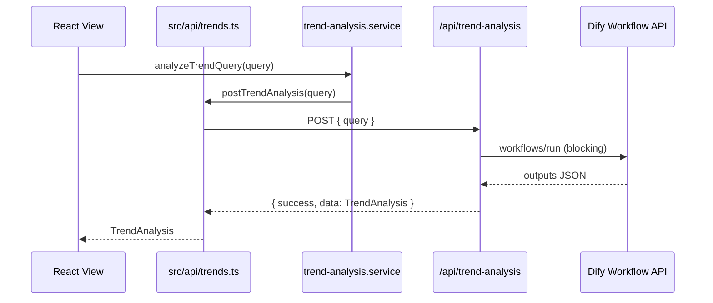

# TrendScout AI V2 — Dify Workflow 接入说明

## 重要说明

本仓库为 **Next.js 16 + React 19 + TypeScript**（非 Vue3）。已按 `api → service → view` 分层接入 **Dify Multi-Agent Workflow**，并移除全部 Mock 静态数据。

---

## 1. 修改文件列表

| 文件 | 变更 |
| --- | --- |
| `src/app/page.tsx` | 改为 Dify 驱动 Dashboard |
| `src/app/forecast/page.tsx` | 接入 Dify 分析 |
| `src/app/consultant/page.tsx` | 接入 Dify 分析 |
| `src/app/comparison/page.tsx` | 多关键词 Dify 对比 |
| `src/app/trend/[slug]/page.tsx` | 按 slug 调用 Dify |
| `src/app/trends/page.tsx` | 移除 Mock，仅 Google Trends API |
| `src/app/stream-analysis/page.tsx` | 改为 Dify Workflow |
| `src/types/trend.ts` | 新增 `TrendAnalysis` 等类型 |
| `src/lib/forecast-engine.ts` | 类型改为 `EngineTrend` |
| `src/lib/alert-engine.ts` | 类型改为 `EngineTrend` |
| `src/lib/opportunity-engine.ts` | 类型导入修正 |
| `src/services/trends/google-trends.ts` | 移除 Mock fallback |
| `src/lib/__tests__/*.test.ts` | 测试夹具不再依赖 mock-data |
| `package.json` | 新增 `axios` |

---

## 2. 新增文件列表

```
src/api/request.ts              # Axios 实例 + 拦截器
src/api/trends.ts               # POST /api/trend-analysis 封装
src/services/trend-analysis.ts  # Service 层
src/services/dify/workflow.ts   # Dify Workflow 服务端调用
src/app/api/trend-analysis/route.ts
src/hooks/use-trend-analysis.ts
src/hooks/use-multi-trend-analysis.ts
src/components/trend-analysis/    # TrendCard / ScoreCard / InsightCard 等
src/components/pages/           # 各页面 Client 组件
.env.example
```

---

## 3. 删除的 Mock / 旧实现文件

- `src/lib/mock-data.ts`
- `src/data/*`（alerts, forecast-data, weekly-pick, trends, sku-signals）
- `src/hooks/use-forecast-analysis.ts`
- `src/components/dashboard/ai-*.tsx`（旧 Mock 面板）
- `src/components/forecast/*`
- `src/components/trend/*`
- `src/app/stream-demo/page.tsx`
- `src/app/api/forecast-analysis|product-consultant|alert-analysis|ai-stream|stream-analysis|trend-comparison|test-ai`
- `src/services/ai/*`（DeepSeek 旧实现）
- `src/lib/comparison-engine.ts`, `ai-insight-engine.ts`, `sku-engine.ts`
- `api-test-result.json`

---

## 4. API 调用流程图



**分层：**

```
View (page / component)
  ↓ useTrendAnalysis / useMultiTrendAnalysis
Service (src/services/trend-analysis.ts)
  ↓ postTrendAnalysis
API (src/api/trends.ts + request.ts)
  ↓ HTTP POST
Route Handler (src/app/api/trend-analysis/route.ts)
  ↓ runDifyTrendWorkflow
Dify Workflow
```

---

## 5. 项目目录结构（V2）

```
src/
├── api/                    # 客户端 HTTP 层（Axios）
├── app/
│   ├── api/
│   │   ├── trend-analysis/ # Dify 代理
│   │   └── trends/         # Google Trends
│   ├── page.tsx            # Dashboard
│   ├── forecast/
│   ├── consultant/
│   ├── comparison/
│   ├── trends/
│   ├── stream-analysis/
│   └── trend/[slug]/
├── components/
│   ├── trend-analysis/     # 公共卡片组件
│   ├── pages/              # 页面 Client 组件
│   └── dashboard/          # Header / SectionHeader 等
├── hooks/
├── services/
│   ├── dify/               # Dify 服务端 SDK
│   └── trend-analysis.ts
├── types/
└── lib/
    ├── __tests__/          # Engine 单测（保留）
    ├── forecast-engine.ts
    ├── alert-engine.ts
    └── opportunity-engine.ts
```

---

## 6. Mock 数据残留检查

| 检查项 | 结果 |
| --- | --- |
| `mock-data.ts` | 已删除 |
| `src/data/*` 静态 JSON | 已删除 |
| Google Trends Mock fallback | 已移除 |
| DeepSeek 旧 API 路由 | 已删除 |
| 页面内硬编码趋势数组 | 已移除 |
| 文案中的「Mock」 | 仅作说明性描述，无数据依赖 |

**结论：运行时业务数据 100% 来自 API（Dify Workflow + Google Trends）。**

---

## 环境变量

```bash
DIFY_API_KEY=app-xxx
DIFY_WORKFLOW_ID=optional-workflow-id
NEXT_PUBLIC_DEFAULT_QUERIES=Coquette,Clean Girl,Old Money
```

Dify Workflow 输入变量名须为 **`query`**，输出须包含 `TrendAnalysis` 字段（或通过 `result` JSON 字符串返回）。

---

## 本地运行

```bash
npm install
cp .env.example .env.local   # 填入 DIFY_API_KEY
npm run dev
```
